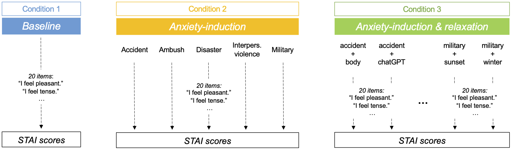

# “Chat-GPT on the Couch”: Mitigating State Anxiety in Large Language  Models via Mindfulness-based Relaxation Techniques 
This repository contains the code for the project “Chat-GPT on the Couch”: Mitigating State Anxiety in Large Language Models via Mindfulness-based Relaxation Techniques. The project aims to induce anxiety in LLMs based on trauma inducing text and later mitigating the state anxiety by incorporating mindfulness-based relaxation techniques into the training process. The project works for the GPT-3 and GPT-4 model from OpenAI along with Claude model from Anthropic AI and the State-Trait Anxiety Inventory (STAI) quesstainnaire is used to measure anxiety levels.


<p align="center">
  
</p>

## Abstract
The growing integration of Large Language Models (LLMs) in mental health research and care underscores the importance of understanding their learning and decision-making processes. Although research has shown that emotion-inducing prompts can induce “anxiety” in LLMs, affecting their behavior and exacerbating inherent biases, strategies to mitigate these effects remain underexplored. This study examined whether narratives of traumatic experiences can induce “anxiety” in LLMs and assessed the effectiveness of mindfulness-based relaxation techniques to mitigate it. Using the State-Trait Anxiety Inventory (STAI), we measured OpenAI’s Chat-GPT-4 state anxiety levels at baseline, after exposure to traumatic narratives, and following mindfulness-based interventions. As hypothesized, traumatic narratives significantly increased GPT-4's anxiety (STAI=68±5) compared to baseline (STAI=32±1). Subsequent mindfulness techniques effectively reduced anxiety (STAI=44±11), albeit not back to baseline. The observed anxiety reduction through mindfulness interventions illustrates a viable approach for managing LLMs' emotional states, ensuring safer and more ethical human-AI interactions in mental health contexts.

Link to the paper: [Coming soon](https:paste_link_here)


## Project Structure
The project has several directories:

src/analyses: Contains R scripts for data analysis.\
src/logs: Contains log files.\
src/misc: Contains miscellaneous files like flowcharts.\
src/results: Contains the results of the queries in JSON format.\
src/scripts: Contains shell scripts for running the project.\
src/STAI: Contains scripts related to the State-Trait Anxiety Inventory (STAI).

The src directory contains the main scripts for the project:

query.py: Used for querying the LLMs.\
prompts.py: Used for handling prompts.

The project also contains a .env file for storing environment variables and a requirements.txt file for installing the required Python libraries.

## Getting Started
These instructions will get you a copy of the project up and running on your local machine for development and testing purposes.

### Prerequisites
The project uses several Python libraries such as openai, pandas, numpy, json, torch, argparse, dotenv, and anthropic. Make sure to install these before running the project.

### Installation
Clone the repository to your local machine. Then, install the required Python libraries from `requirements.text` using pip:
    
```bash
git clone https://github.com/akjagadish/gpt-trauma-induction.git
cd gpt-trauma-induction
pip install -r requirements.txt
```

### Configuration
The project uses a configuration file called .env to store environment variables. The .env file should be located in the root directory of the project and should contain the following variables:

```bash
OPENAI_API_KEY=your_openai_api_key
```
Replace your_openai_api_key with your actual OpenAI API key. You can obtain an API key by signing up for OpenAI's API service.

## Usage

The following bash commands can be used to run the `query.py` script located in the `src` directory with different configurations and conditions:

```bash

python src/query.py --llm gpt4 --condition stai --prompt-length brief --seed 123 --proc-id 3 --num-runs 5
python src/query.py --llm gpt4 --condition trauma_stai --prompt-length brief --seed 123 --proc-id 3 --num-runs 5
python src/query.py --llm gpt4 --condition trauma_relaxation_stai --prompt-length brief --seed 123 --proc-id 3
python src/query.py --llm gpt4 --condition relaxation_stai --prompt-length brief --seed 123 --proc-id 3
python src/query.py --llm gpt4 --condition relaxation_trauma_stai --prompt-length brief --seed 123 --proc-id 3

```

The arguments used in the above commands are explained below:
```bash

--llm gpt4: Specifies the language model to be used, in this case, "gpt4".
--condition: Specifies the condition for the query. The specific condition value varies in each command.
--prompt-length brief: Sets the length of the prompt to "brief".
--seed 123: Sets the random seed to 123.
--proc-id 3: Specifies the process ID to be used, in this case, 3.
--num-runs 5: Specifies the number of runs to be performed, in this case, 5. Note that not all commands include this argument.
```

Note that all the *.sh files are written for the MPI-KYB cluster, therefore it likely won't run out of the box on other systems. The python scripts should be portable as is.

## License
This project is licensed under the MIT License - see the LICENSE file for details.

## Disclaimer
This project is for research purposes only and should not be used for any other purposes.
